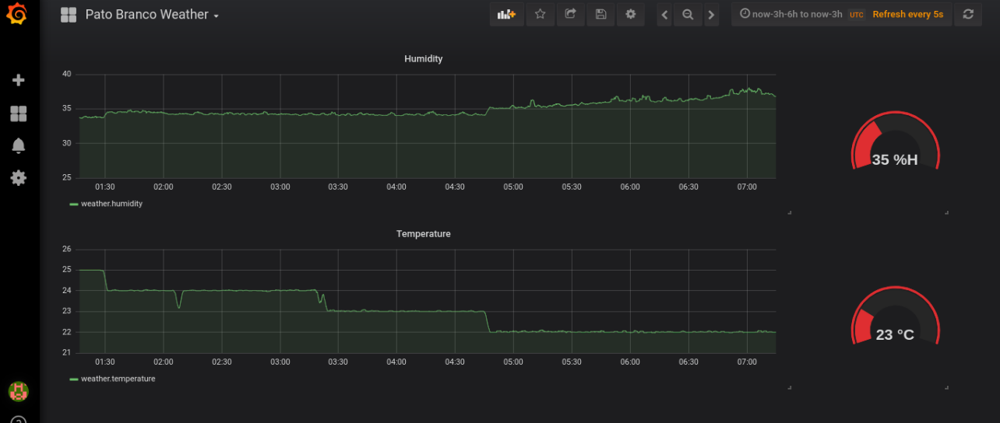

# Temperature and Humidity monitoring with ESP8266, InfluxDB and Grafana


This ESP8266 firmware turns Weather Sensor into InfluxDB database. It allows visualising the Temperature and Humidity variables updates for the DHT-11 sensor using Grafana Dashboards.

## What you will need
To build and run this project you will need the followings:

* ESP8266 (I used the ESP-01)
* DHT11 (temp/humidity sensor)
* Visual Studio Code + PlatformIO
* InfluxDB
* Grafana

## Diagram


## Installation and setup

### InfluxDB
#### Installation

For Ubuntu users, add the InfluxData repository with the following commands:


```bash
wget -qO- https://repos.influxdata.com/influxdb.key | sudo apt-key add -
source /etc/lsb-release
echo "deb https://repos.influxdata.com/${DISTRIB_ID,,} ${DISTRIB_CODENAME} stable" | sudo tee /etc/apt/sources.list.d/influxdb.list
```

Next

```bash
sudo apt-get update && sudo apt-get install influxdb
sudo service influxdb start
```

Create a database by the CLI (`influxd`):

```bash
> CREATE DATABASE sensors
> use sensors
```

The ESP-01 Sensor put the data intro the mesurements `weather`. A simple query to check if it works.

```bash
> use sensors
> SELECT * FROM "weather" ORDER BY time DESC limit 10
name: weather
time                 humidity location    temperature
----                 -------- --------    -----------
2019-11-19T07:15:11Z 37       pato-branco 22
2019-11-19T07:15:10Z 37       pato-branco 22
2019-11-19T07:15:09Z 37       pato-branco 22
2019-11-19T07:15:08Z 37       pato-branco 22
2019-11-19T07:15:07Z 37       pato-branco 22
2019-11-19T07:15:06Z 37       pato-branco 22
2019-11-19T07:15:05Z 37       pato-branco 22
2019-11-19T07:15:04Z 37       pato-branco 22
2019-11-19T07:15:03Z 37       pato-branco 22
2019-11-19T07:15:02Z 39       pato-branco 22

```

### Grafana

#### Installation
Use the above line even if you are on Ubuntu or another Debian version.

```bash
wget -q -O - https://packages.grafana.com/gpg.key | sudo apt-key add -
Update your Apt repositories and install Grafana:
```

```bash
sudo apt-get update
sudo apt-get install grafana
```

In the Grafana add a Influx Database Source by `<INFLUXDB_IP>:8086`, measurement `weather`.

Apply the Measurment Moving Average:
```sql
SELECT MOVING_AVERAGE("humidity",100) as "humidity" FROM "weather" WHERE $timeFilter
```

and

```sql
SELECT MOVING_AVERAGE("temperature",100) as "temperature" FROM "weather" WHERE $timeFilter
```

Reference : https://grafana.com/docs/installation/

#### Dashboard Example


